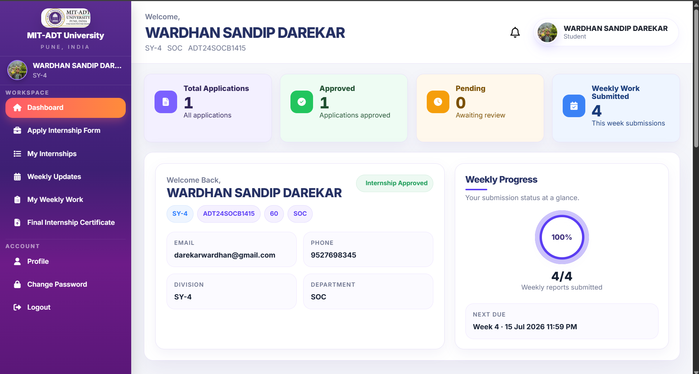
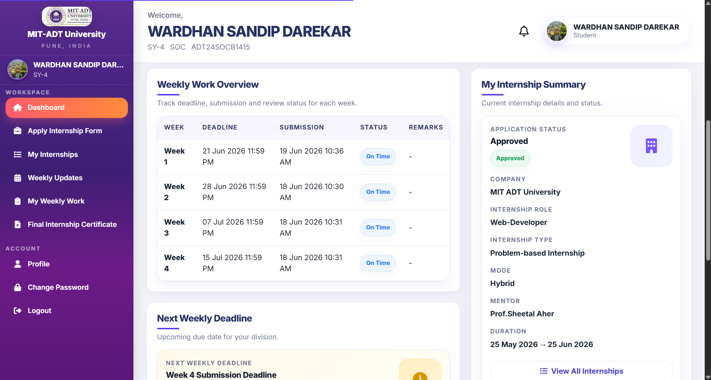
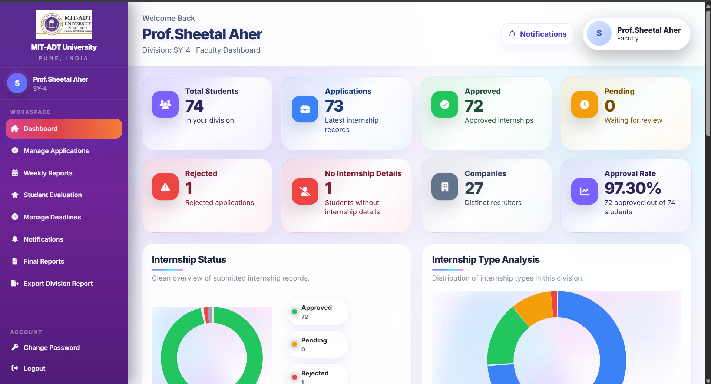
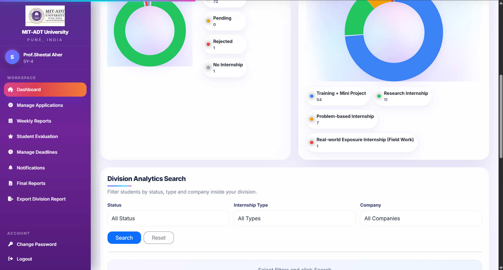
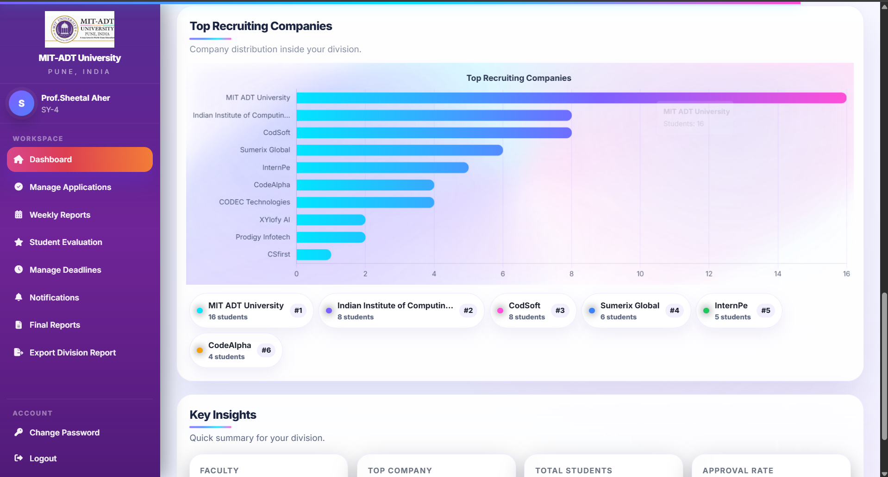
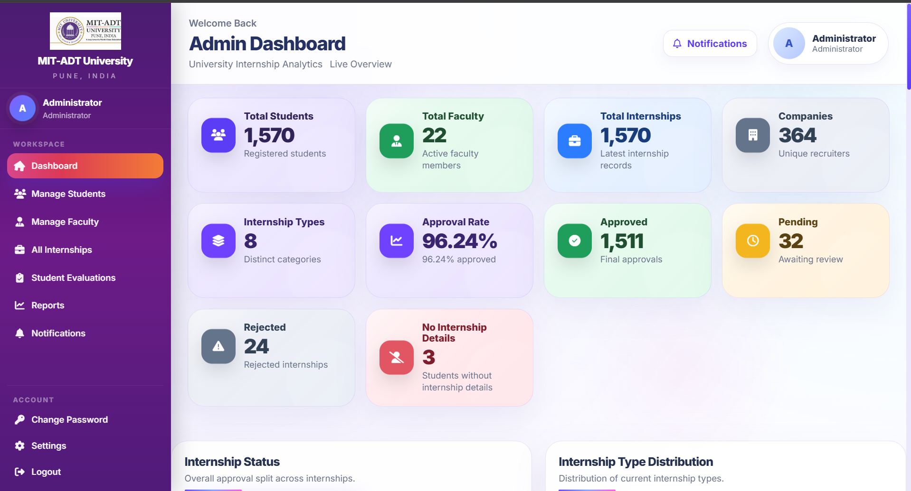

# MIT Internship Management Portal

A full-stack web application developed using **PHP, MySQL, HTML, CSS, Bootstrap, and JavaScript** to simplify and digitize the internship management process at **MIT Art, Design and Technology University**.

---

# Overview

The MIT Internship Management Portal is a comprehensive web-based application developed to automate and streamline the internship management process within the university.

The system provides a centralized platform for **Students**, **Faculty Members**, and **Administrators** to manage the complete internship lifecycle. Students can apply for internships, upload offer letters, submit weekly reports, and track their internship progress. Faculty members can review applications, evaluate students, provide feedback, manage submission deadlines, and export evaluation reports. Administrators can efficiently manage students, faculty members, internship records, and monitor overall internship activities through an interactive dashboard.

The project focuses on improving efficiency, reducing paperwork, ensuring transparency, and providing a better user experience through role-based access control and an intuitive interface.

---

---

# Screenshots

## Login Page

<p align="center">
  
</p>

---

## Student Dashboard

<p align="center">
  
</p>

---

## Student Weekly Work

<p align="center">
  
</p>

---

## Faculty Dashboard

<p align="center">
  
</p>

---

## Faculty Analytics

<p align="center">
  
</p>

---

## Faculty Student Evaluation

<p align="center">
  
</p>

---

## Admin Dashboard

<p align="center">
  
</p>

# Features

## Student Module

- Student Login
- Internship Application
- Offer Letter Upload
- Weekly Report Submission
- View Faculty Feedback
- Track Internship Status
- Profile Management
- Change Password

---

## Faculty Module

- Review Internship Applications
- Approve / Reject Applications
- View Student Details
- Manage Weekly Submission Deadlines
- Evaluate Student Performance
- Add and Edit Feedback
- Export Student Evaluation Reports to Excel
- View Weekly Reports

---

## Admin Module

- Dashboard Analytics
- Manage Students
- Manage Faculty
- Student Evaluation Dashboard
- Internship Reports
- Export Student Evaluation Reports
- Manage System Settings

---

# Technology Stack

## Frontend

- HTML5
- CSS3
- Bootstrap 5
- JavaScript

## Backend

- PHP

## Database

- MySQL

## Libraries

- PHPMailer

---

# Key Features

- Role-Based Authentication
- Student Internship Management
- Faculty Evaluation System
- Weekly Report Management
- Deadline Management
- Feedback System
- Dashboard Analytics
- Excel Report Export
- Responsive User Interface
- Secure File Upload System

---

# Project Modules

- Student Management
- Faculty Management
- Internship Application Management
- Weekly Report Management
- Student Evaluation System
- Feedback Management
- Dashboard Analytics
- Excel Report Generation

---

# Folder Structure

```text
MIT-Internship-Management-Portal
│
├── admin
├── faculty
├── student
├── assets
│   └── images
├── PHPMailer
│
├── config.php
├── login.php
├── logout.php
├── index.php
├── mail_function.php
├── otp_verify.php
├── verify_login_otp.php
└── send_login_otp.php
```

---

# Installation

### 1. Clone the repository

```bash
git clone https://github.com/darekarwardhan-wq/MIT-Internship-Management-Portal.git
```

### 2. Open the project inside XAMPP or your preferred PHP server.

### 3. Create a MySQL database.

### 4. Import the SQL database file.

### 5. Update the database credentials in `config.php`.

### 6. Start Apache and MySQL.

### 7. Open the project in your browser.

---

# Future Enhancements

- Email Notifications
- PDF Report Generation
- Advanced Dashboard Analytics
- Attendance Tracking
- Internship Completion Certificate Generation
- Mobile Responsive Improvements

---

# Project Team

This project was developed as a **Project Based Learning (PBL)** project at **MIT Art, Design and Technology University**.

### Team Members

- **Wardhan Sandip Darekar**
- **Swaraj Ingale**
- **Suyash Taral**

---

# Live Demo

🌐 https://mitinternship.online

---

# Author

**Wardhan Sandip Darekar**

B.Tech Computer Science Engineering

MIT Art, Design and Technology University

📧 Email: darekarwardhan@gmail.com

🔗 LinkedIn

https://www.linkedin.com/in/wardhan-sandip-darekar-063090367/

💻 GitHub

https://github.com/darekarwardhan-wq

---

# License

This project has been developed for educational purposes as part of the Summer Internship curriculum at MIT Art, Design and Technology University.

---

⭐ If you found this project useful, consider giving it a star on GitHub!
